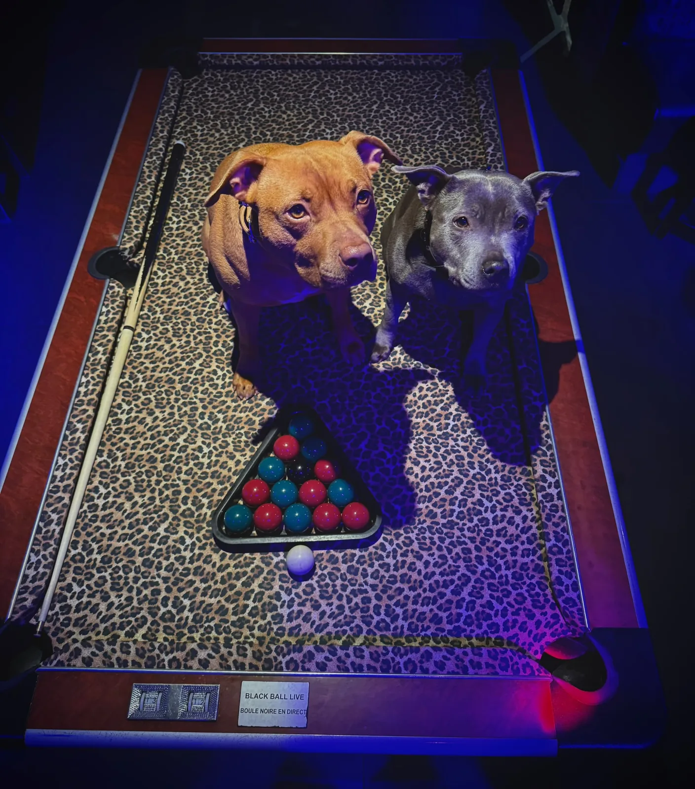

# BRIEF V2.1 — PASSAGE EN NIVEAU AWWWARDS
### Barrel Pub Cannes — additif au brief de fondation. À appliquer sur le build existant.

---

## §0 — RÈGLES DE CE LOT (non négociables)

1. **Ce brief est ADDITIF.** Tout ce qui fonctionne aujourd'hui reste. On n'a pas le droit de régresser.
2. **LE HERO NE BOUGE PAS.** `js/hero.js` : zéro ligne modifiée. Le canvas, le scrub, les 227 frames, le préchargeur, le failsafe 7 s, les fenêtres `data-in`/`data-out`, le line-reveal : **intouchables.** Si une optimisation de ce brief semble impliquer le hero, tu ne la fais pas.
3. **Sous le hero pinné : jamais de ScrollTrigger.** IntersectionObserver ou rAF borné. Cette règle a déjà coûté une journée de debug, elle ne se rediscute pas.
4. **Un seul `requestAnimationFrame` global**, branché sur `gsap.ticker`. Chaque nouvelle animation s'y abonne, elle n'ouvre pas sa propre boucle. Toute boucle a une condition de sortie (`document.hidden`, compteur de frames, flag IO).
5. **Toujours vanilla.** Pas de framework, pas de build step, pas de npm run. Libs vendorisées dans `/vendor/`. Aucune nouvelle dépendance externe autorisée en dehors de celles listées au §4.
6. **Avant de committer : la checklist de non-régression du §8.** Si un point échoue, tu reviens en arrière sur la fonctionnalité fautive, pas sur la checklist.

---

## §1 — LA PHOTO DES DEUX CHIENS

La photo actuellement dans le chapitre 02 « Le seuil » est cadrée sur un seul chien, vu de dos, tête coupée. Le texte à côté dit **« Deux chiens veillent sur la maison »** — il y a un mensonge à l'image.

**Remplacement :** `assets/photos/chiens-duo.webp` (1408 × 1600, fourni avec ce brief).

Les deux staffies sont assis sur le tapis léopard du billard, **le triangle rackté devant eux, la queue posée à gauche, les deux têtes en plein cadre, regard caméra.** C'est l'image la plus forte du lot photo : elle raconte le lieu (billard, léopard, néon bleu et rose) et elle raconte l'idée du site (le chien te fait entrer) dans un seul cadre.

```html
<!-- chapitre 02 — le seuil -->

```

**Trois choses à faire en même temps que le swap :**

- La légende passe de `SUR LE BILLARD — COMME D'HABITUDE` à **`LES PATRONS — SUR LE BILLARD, COMME D'HABITUDE`**.
- Le cadrage `object-position` doit être `center 38%` : le regard des chiens doit tomber sur la ligne de force haute, pas au milieu.
- **C'est la seule image du site qui a droit au traitement « regard »** décrit au §3.11 (parallaxe inversée très légère). Ailleurs, non.

`chien-billard-01.webp` reste dans les assets — il sert de fallback OG et peut réapparaître en petit format dans la mosaïque du chapitre 03.

---

## §2 — LES PHOTOS QUI MANQUENT, PLACÉES STRATÉGIQUEMENT

Il y a 57 photos dans `assets/photos/`. Le build actuel en utilise moins de la moitié. Ce n'est pas une galerie qu'on veut — c'est un **rythme**. Voici où chaque photo tombe, et pourquoi.

### 2.1 — Chapitre 02, Le seuil
| Fichier | Emplacement | Rôle |
|---|---|---|
| `chiens-duo.webp` | Pleine hauteur, colonne droite | L'image maîtresse. Voir §1. |
| `facade-nuit.webp` | Bande fine pleine largeur, avant le mur typo | Le plan d'établissement : on est dehors, il fait nuit. |

### 2.2 — Chapitre 03, Le jeu (mosaïque asymétrique)
Grille de 6 cases, hauteurs inégales, révélation en stagger de 90 ms. **Chaque case porte une légende mono en bas à gauche**, pas un titre.

| Fichier | Format | Légende |
|---|---|---|
| `salle-billard-bleue.webp` | Grande, 2 colonnes | `LA SALLE DU FOND` |
| `flechettes.webp` | Petite | `FLÉCHETTES` |
| `photobooth-ta-bobine.webp` | Moyenne, paysage | `TA BOBINE — 4 FLASHS, 3€` |
| `billard-joueur.webp` | Haute | `BLACK BALL LIVE` |
| `ecrans-sport.webp` | Paysage | `10 ÉCRANS` |
| `chien-billard-01.webp` | Petite | `IL SURVEILLE LE JEU` |

### 2.3 — Chapitre 03, Le mur des néons
| Fichier | Rôle |
|---|---|
| `neon-exactly-where.webp` | Fond plein écran de la section, `opacity: 0.22`, `filter: saturate(1.3)`. La typo géante CSS passe **par-dessus**, elle ne remplace pas la photo — les deux se superposent, l'enseigne réelle floutée derrière l'enseigne typographique nette. |
| `neon-alexa-foule.webp` | Bande basse, collée au bloc DJ. |

### 2.4 — Chapitre 03, La nuit
Carrousel horizontal scrubbé (§3.6), 7 images, sans texte, juste un compteur mono `01 / 07` :
`foule-bleue.webp` → `dj-booth.webp` → `foule-billard.webp` → `foule-tonneau.webp` → `barman-flair.webp` → `foule-01.webp` → `foule-nb.webp`

La dernière en noir et blanc ferme la séquence — c'est voulu, ne la colorise pas.

**Le bloc moto**, juste après, en triptyque fixe : `moto-rose-01.webp`, `moto-comptoir.webp`, `moto-portrait.webp`.
Surtitre mono : `ET OUI, ELLE EST À L'INTÉRIEUR.`

### 2.5 — Chapitre 04, La carte
Chaque ligne de burger porte une vignette **qui n'apparaît qu'au hover / focus** (§3.4), en 220 px de côté, positionnée en absolu à droite du curseur :

| Ligne du menu | Vignette |
|---|---|
| Better than your ex — 16€ | `burger-01.webp` |
| Orgasmeat — 18€ | `burger-plateau.webp` |
| Maya l'abeille — 16€ | `burger-02.webp` |
| Chicken — 16€ | `burger-chicken.webp` |
| Black Barrel — 15€ | `burger-black-barrel.webp` |

Bandeau tapas en marquee infini (§3.3), images carrées 180 px, défilement continu :
`frites-curly-01.webp`, `chicken-strips.webp`, `frites-curly-02.webp`, `burger-pulled.webp`, `cocktail-01.webp`, `cocktail-03.webp`, `burger-04.webp`, `cocktail-02.webp`

### 2.6 — Chapitre 05, Le lieu
| Fichier | Emplacement |
|---|---|
| `terrasse-nuit-01.webp` | Grande, pleine largeur |
| `terrasse-nuit-02.webp` | Colonne |
| `terrasse-heure-bleue.webp` | Colonne |
| `terrasse-tonneaux.webp` | Bande |
| `facade-crepuscule.webp` | Fond du bloc infos pratiques, `opacity: 0.15` |
| `staff-futs.webp` | Petit encart « L'ÉQUIPE », à côté des chiffres |

`facade-jour.webp`, `terrasse-jour-01/02.webp` : **image OG et rien d'autre.** On ne revient jamais au plein jour dans le parcours.

### 2.7 — Règle transversale sur toutes les images ajoutées
```html

```
`width` et `height` réels et obligatoires sur chaque balise — c'est ce qui tient le CLS à 0. Les dimensions sont dans `assets/photos/INDEX.txt`.

---

## §3 — LES DOUZE AJOUTS QUI FONT LA DIFFÉRENCE

Le barème Awwwards est **Design 40 / Usability 30 / Creativity 20 / Content 10**. L'usabilité pèse plus que la créativité : chaque effet ci-dessous a une porte de sortie (reduced-motion, mobile, clavier). Un effet qui n'a pas sa porte de sortie ne se fait pas.

**Discipline générale : un seul effet signature par section.** Un easing unique dans tout le site — `CustomEase "barrel"` / `cubic-bezier(0.625, 0.05, 0, 1)`, déjà en place. Trois durées seulement : **0,6 s / 0,9 s / 1,2 s.**

### 3.1 — Le split-text reveal, partout
Tous les titres et paragraphes de chapitre entrent ligne par ligne, masqués par `overflow: hidden`, montée de `y: 100%`, stagger 70 ms. C'est déjà la grammaire du hero — on l'étend au reste du site, ce qui donne au parcours son unité.

Découpe faite **une seule fois au `load`**, jamais au scroll (sinon reflow en boucle). Le texte réel reste dans le DOM (SEO, lecteurs d'écran) ; on n'insère que des `<span>` de présentation avec `aria-hidden="false"` sur le conteneur.

```js
function splitLines(el){
  const words = el.textContent.trim().split(/\s+/);
  el.textContent = '';
  const frag = document.createDocumentFragment();
  words.forEach((w,i)=>{
    const s = document.createElement('span');
    s.className = 'w'; s.textContent = w + (i<words.length-1?' ':'');
    frag.appendChild(s);
  });
  el.appendChild(frag);
  // regroupement par offsetTop → une ligne = un .ov-line > span
}
```

### 3.2 — Le text-scramble sur les données mono
Tous les nombres et libellés en IBM Plex Mono se « décodent » à l'entrée en viewport : 28 frames, caractères tirés dans `ABCDEFGHIJKLMNOPQRSTUVWXYZ0123456789/\\|—•`, puis le vrai texte se fixe caractère par caractère.

S'applique à : l'horloge live, les prix, les chiffres du chapitre 05, les coordonnées GPS, les légendes de photos. **Jamais sur un `<h1>` ou `<h2>`** — on garde le texte réel pour le SEO.

Borné à 28 frames, un seul scramble à la fois par section, `unobserve` après passage.

### 3.3 — Le marquee à vélocité de scroll
Le bandeau tapas et le bandeau de bas de page (`OUVERT 18H → 05H • 7J/7 • CANNES CARRÉ D'OR • BLACK BALL LIVE • KARAOKÉ •`) défilent en continu, et **accélèrent proportionnellement à la vélocité de scroll de Lenis**, avec inversion de sens quand on remonte.

```js
let mq = 0, vel = 0;
lenis.on('scroll', e => { vel = e.velocity; });
gsap.ticker.add(() => {
  mq -= (0.6 + Math.min(Math.abs(vel) * 0.09, 4)) * Math.sign(vel || 1);
  track.style.transform = `translate3d(${mq % (trackW/2)}px,0,0)`;
});
```
Contenu dupliqué ×2 pour la boucle. `will-change: transform` sur la piste **uniquement**, jamais sur les enfants.

### 3.4 — La vignette qui suit le curseur sur le menu
Au survol d'une ligne de burger, une vignette 220 px apparaît, suit le curseur en lerp 0.14, avec un très léger décalage de rotation proportionnel à la vitesse horizontale (`rotate: clamp(-8deg, dx*0.4, 8deg)`). Disparition en `scale(0.92)` + fade 0,25 s.

**Sur mobile et au clavier :** pas de vignette flottante. L'image apparaît en bloc statique sous la ligne active, animée en `@starting-style`. Le `tabindex="0"` et l'accent `--accent` déjà en place restent.

Une seule `` réutilisée, dont on change le `src` — pas 5 images empilées dans le DOM.

### 3.5 — Le curseur magnétique
Les boutons (`RÉSERVER`, le CTA du hero, les liens du footer) attirent le curseur custom quand il passe à moins de 80 px : le point se déplace vers le centre de l'élément en lerp, et le bouton lui-même se décale de 30 % du delta. Le curseur devient un anneau de 44 px avec un label contextuel (`VOIR`, `RÉSERVER`, `APPELER`).

Réutilise la boucle curseur existante de `global.js` (lerp 0.28, sortie sur `idleFrames > 40`). **Coupé net** sur `(pointer: coarse)` et sur `prefers-reduced-motion`.

### 3.6 — Le carrousel de nuit scrubbé horizontalement
Le chapitre 03 « la nuit » défile latéralement pendant qu'on scrolle verticalement. Compteur mono `01 / 07` en bas à droite.

**Attention — c'est le point le plus risqué du lot :**
- Le pin ne dépasse **jamais 260 vh**. Au-delà, le jury sanctionne le scroll hijack.
- Le pin étant sous le hero, il ne peut pas utiliser ScrollTrigger. Implémentation en IntersectionObserver + `position: sticky` natif + `transform: translate3d` calculé sur `getBoundingClientRect()` dans le ticker global.
- Un lien d'ancrage doit pouvoir sauter la section entière.
- Sur mobile : pas de pin. On repasse en `scroll-snap-type: x mandatory` natif, glissé au doigt.

Si le comportement n'est pas parfaitement fluide en test, **on le remplace par une grille classique.** Un carrousel mal fichu coûte plus cher qu'il ne rapporte.

### 3.7 — Le glow néon avec grésillement
La typo géante du mur des néons reçoit un `text-shadow` multi-couches (`0 0 8px`, `0 0 24px`, `0 0 60px` en `--bleu-clair`) et un flicker en keyframes **non linéaires** : de vrais tubes néon ne clignotent pas en rythme. Salve de 1,2 s toutes les 9 s environ, jamais en boucle permanente.

Limité à **deux éléments à l'écran au maximum** : `filter` force une couche de peinture, c'est le poste le plus cher du site.

### 3.8 — Le glitch RGB au passage de section
À la bascule entre deux chapitres, un décalage RGB très court (110 ms) sur le titre entrant : `text-shadow` bleu et or décalés de 3 px en sens opposés, plus deux tranches de `clip-path` qui sautent. Effet « le néon vient de s'allumer ». Une seule salve, déclenchée à l'entrée en viewport, jamais en boucle.

### 3.9 — Le skew de vélocité, dosé
Le contenu des sections « traîne » légèrement au scroll rapide : `skewY` proportionnel à la vélocité Lenis, **clampé à ±3,5°** (la signature Studio Freight est à ±6, on est un pub, pas un studio de motion — on reste sobre).

Coupé sur `prefers-reduced-motion`. Ne s'applique jamais aux photos de plats ni au bloc infos pratiques.

### 3.10 — Le grain animé
Texture pellicule sur tout le site : **un WebP tileable de 128 px**, `background-position` shifté en `steps(8)` sur 0,8 s, `opacity: 0.045`, `mix-blend-mode: overlay`, `pointer-events: none`, en `position: fixed` plein écran.

**Surtout pas de `feTurbulence` SVG animé en continu** — c'est un tueur de framerate. Le PNG/WebP tileable est quasi gratuit.

### 3.11 — La parallaxe inversée sur la photo des chiens
La seule photo du site à avoir un traitement propre. L'image se déplace à 0,88× la vitesse du scroll dans un conteneur en `overflow: hidden` — les deux chiens semblent **rester fixes pendant que la page glisse autour d'eux**. Effet de regard soutenu, très court, très efficace.

Calcul dans le ticker global, `translate3d` uniquement, plafonné à ±60 px.

### 3.12 — Le compteur odomètre
Les chiffres du chapitre 05 ne comptent plus en incrémentant du texte : chaque chiffre est une colonne de 0-9 qui roule et s'arrête, en `font-variant-numeric: tabular-nums`. Le décompte arrive avec un décalage de 60 ms par colonne, de gauche à droite.

Réutilise le count-up IO + rAF borné à 200 frames déjà écrit. `reduced-motion` → valeur finale affichée directement.

---

## §4 — LES APIS NATIVES 2026 QU'ON ACTIVE

Vérifié en juillet 2026. **GSAP reste la source de vérité pour tout le motion chorégraphié** — c'est ce qui est jugé. Les API natives prennent l'UI et les micro-reveals.

| API | Statut | Ce qu'on en fait ici |
|---|---|---|
| **Popover API** (`popover`, `:popover-open`, `::backdrop`) | Baseline depuis janvier 2025 | **Le menu mobile, la carte complète, les horaires.** On gagne le focus trap, la fermeture à l'Escape et le light-dismiss **gratuitement**. Supprime une soixantaine de lignes de JS et rend la nav réellement accessible. |
| **`@starting-style` + `transition-behavior: allow-discrete`** | Baseline depuis août 2024 | Animer l'entrée des éléments qui passent de `display: none`. Remplace le JS d'ouverture de modale et la vignette menu en version mobile. |
| **`text-wrap: balance` / `pretty`** | Baseline depuis octobre 2024 | `balance` sur **tous** les titres Archivo Black — plus jamais de veuve typographique sur un gros titre. `pretty` sur les paragraphes. Deux lignes de CSS, gain visuel immédiat. |
| **Container queries** | Largement disponible | Les cartes menu et les cases de la mosaïque s'adaptent à leur colonne, pas au viewport. Fin des media queries en cascade. |
| **`:has()`** | Largement disponible | `.burger-row:has(:focus-visible)` pour allumer l'accent au clavier sans JS. |
| **View Transitions same-document** | Baseline (Firefox 144, oct. 2025) | Si un filtre de galerie apparaît plus tard. Pas nécessaire aujourd'hui. |
| **CSS scroll-driven animations** (`animation-timeline: view()`) | Chrome/Safari 26+ oui, **Firefox toujours non** | **En amélioration progressive uniquement**, et seulement pour les fades simples d'entrée. Sur Firefox l'animation ne joue pas et le contenu reste visible — c'est un dégradé acceptable. Tout ce qui est chorégraphié reste en GSAP. |
| **CSS Anchor Positioning** | Baseline janvier 2026 | Les labels flottants du curseur contextuel, avec fallback en `transform`. |

---

## §5 — TROIS SECTIONS EN PLUS

### 5.1 — « CE SOIR » — le bloc programme (chapitre 03, après la nuit)
Un bloc mono qui lit le jour réel du visiteur et affiche le programme correspondant, sur le modèle de l'horloge live déjà en place :

```
LUNDI      · KARAOKÉ
MARDI      · BLACK BALL — TOURNOI BILLARD
MERCREDI   · DJ SET
JEUDI      · LIVE
VENDREDI   · DJ SET — JUSQU'À 5H
SAMEDI     · DJ SET — JUSQU'À 5H
DIMANCHE   · SPORT SUR LES 10 ÉCRANS
```
La ligne du jour courant est en `--bleu-clair`, gonflée, avec un point qui pulse ; les autres à `opacity: 0.35`. Le jour est calculé côté client, le tableau complet est **écrit en dur dans le HTML** — si le JS meurt, les sept lignes restent lisibles.

> **À faire valider par la cliente :** ce planning est une hypothèse construite à partir des photos et du dossier. Il faut ses vrais jours avant mise en ligne. En attendant, mets un commentaire HTML `<!-- PROGRAMME À CONFIRMER PAR LE CLIENT -->`.

### 5.2 — « ILS Y ÉTAIENT » — les avis (chapitre 05)
Trois avis Google en gros corps, typo Fraunces italic, un par écran, révélés en split-text. Pas de carrousel automatique, pas d'étoiles en image : les étoiles sont dessinées en SVG inline dans `--or`. Sous chaque avis, en mono : le prénom et la date.

Note Google et compte d'avis en compteur odomètre, avec un lien vers la fiche.

> Il me faut les vrais avis. En attendant, place la structure avec trois `<blockquote>` et un commentaire `<!-- AVIS À REMPLACER PAR LES VRAIS -->`. **Aucun faux avis en ligne** — jamais.

### 5.3 — Le bloc « VENIR » (avant le footer)
Pas une carte Google embarquée (lourde, traçante, et grise au milieu d'un site noir). À la place :

- Les coordonnées GPS en mono géant : `43.5513° N / 7.0128° E`, en text-scramble à l'entrée.
- L'adresse en Archivo Black.
- Trois boutons : `ITINÉRAIRE ↗` (lien `maps.apple.com` + `google.com/maps` selon la plateforme détectée), `APPELER — 06 87 36 11 10` (`tel:`), `ÉCRIRE` (`mailto:`).
- `facade-nuit.webp` en fond, `opacity: 0.2`.
- La mention `À 4 MINUTES À PIED DE LA CROISETTE` — c'est l'argument, il est vrai, il doit être écrit.

---

## §6 — OPTIMISATIONS (ce qui fait perdre un Awwwards)

### 6.1 — Performance
Cibles : **LCP < 2,5 s · INP < 200 ms · CLS < 0,1**, en mobile 4G simulé.

- **Le préchargeur du hero est le risque n°1** : au-delà de ~2,5 s d'attente, le jury comme le visiteur décrochent. Le failsafe est aujourd'hui à 7 s. **Tu ne le modifies pas dans ce lot.** Mesure le temps de préchargement réel des 227 frames en 4G simulée, note-le, et remonte-moi le chiffre — s'il faut descendre le failsafe, ce sera une décision prise à part, sur un commit isolé qui ne touche que cette constante. `hero.js` reste intact dans ce lot, sans exception.
- `<link rel="preload">` sur les 12 premières frames desktop et les 2 woff2 critiques (Archivo Black, Instrument Sans 400).
- `font-display: swap` sur toutes les fontes. Fraunces et IBM Plex Mono en `preload` **non** — elles arrivent plus bas.
- Toutes les images sous le premier écran en `loading="lazy" decoding="async"`, avec `width`/`height`.
- `will-change` **uniquement** sur les éléments réellement animés en continu (piste du marquee, curseur, grain). Posé partout, il détruit la mémoire GPU.
- Pas de `backdrop-filter` sur de grandes surfaces qui scrollent.
- Un seul rAF (§0.4).
- Budget total JS vendorisé : GSAP + ScrollTrigger + CustomEase + Lenis ≈ 90 ko gzip. **Aucune lib en plus.**

### 6.2 — Accessibilité
- **Le bleu `#2B5CFF` sur le noir `#0A0B0E` est à ~3,3:1 — insuffisant pour du texte courant (AA exige 4,5:1).** Il reste une couleur d'accent, de trait, de glow et de fond. Pour les liens et le texte sur fond noir, ajoute `--bleu-lien: #5B82FF` et sers-t'en. C'est un vrai motif d'échec en jury, pas un détail.
- `:focus-visible` doré épais (`outline: 2px solid var(--or); outline-offset: 3px`) sur tout ce qui est focusable. Jamais `outline: none` sans remplacement.
- Un `matchMedia('(prefers-reduced-motion: reduce)')` global qui coupe : skew, parallaxe, scramble, glitch, flicker, marquee, curseur magnétique — et réduit tous les reveals à un fade de 200 ms.
- Le carrousel horizontal est traversable au clavier et sautable par ancre.
- Tous les `alt` réels et descriptifs. Les images purement décoratives (grain, fonds à faible opacité) en `alt=""` avec `aria-hidden="true"`.
- Contraste vérifié sur chaque paire texte/fond avant commit.

### 6.3 — SEO & contenu
- `<title>` : `Barrel Pub Cannes — Le pub du Carré d'Or · Ouvert 18h–5h, 7j/7`
- `<meta name="description">` avec l'adresse et les horaires.
- **JSON-LD `BarOrPub`** complet : `name`, `address`, `geo`, `openingHoursSpecification` (18:00–05:00, sept jours), `telephone`, `servesCuisine`, `priceRange: "€€"`, `sameAs` vers l'Instagram, `hasMenu`.
- Open Graph + Twitter Card, image `facade-jour.webp` recadrée en 1200×630 (c'est le seul usage du plein jour).
- Le texte des chapitres reste du vrai texte dans le DOM, sélectionnable. Rien d'essentiel dans le canvas.
- `lang="fr"`, hiérarchie `h1` → `h2` → `h3` sans saut.

---

## §7 — LA BIBLIOTHÈQUE DE RÉFÉRENCES

Le fichier `BIBLIOTHEQUE-AWWWARDS.md` livré avec ce brief contient les 15 sites de référence, les 18 techniques avec leur coût de perf, et l'état réel du support navigateur des API 2026. **Mets-le à la racine du repo GitHub** — c'est le document qu'on rouvrira sur les prochains projets.

Le skill `awwwards-lab` livré à côté packagera les mêmes techniques sous forme réutilisable.

Trois sites à ouvrir avant de coder, pour caler le rythme : **uncommonstudio.com.au** (le meilleur modèle GSAP sans WebGL), **terminal-industries.com** (quasiment notre palette : mono + bleu électrique sur noir), **glitchandgrit.com** (le glitch et le néon en pur CSS).

---

## §8 — ORDRE D'EXÉCUTION ET CHECKLIST

### Ordre
1. Swap de la photo des chiens (§1) + les deux ajustements de légende et de cadrage. **Commit.**
2. Placement de toutes les photos manquantes (§2), en statique, sans aucune animation nouvelle. **Commit.** — À ce stade le site doit déjà être meilleur qu'avant.
3. Les fondations invisibles : rAF unique, `text-wrap`, container queries, `:focus-visible`, `--bleu-lien`, `matchMedia` global. **Commit.**
4. Les effets faciles et sûrs : split-text (3.1), scramble (3.2), marquee (3.3), odomètre (3.12), grain (3.10). **Commit.**
5. Les effets de curseur : vignette menu (3.4), curseur magnétique (3.5). **Commit.**
6. Les effets d'ambiance : glow néon (3.7), glitch (3.8), skew (3.9), parallaxe chiens (3.11). **Commit.**
7. Les trois sections neuves (§5). **Commit.**
8. Le carrousel horizontal (3.6) **en dernier**, parce que c'est le seul qui peut être abandonné sans rien casser.
9. Passe d'optimisation (§6), mesures, corrections.

### Checklist de non-régression — à repasser à chaque commit
- [ ] Le hero se lance, précharge, scrub, et déverrouille. **`hero.js` strictement inchangé.**
- [ ] Aucun `ScrollTrigger` créé sous le hero.
- [ ] Un seul rAF actif (vérifiable : un seul `gsap.ticker.add` de boucle continue).
- [ ] `prefers-reduced-motion: reduce` → le site reste entièrement lisible et navigable, sans mouvement parasite.
- [ ] Navigation complète au clavier, focus visible partout, Escape ferme le menu.
- [ ] Sur mobile : pas de curseur custom, pas de pin horizontal, pas de parallaxe lourde.
- [ ] Onglet en arrière-plan puis retour : rien n'est figé, rien ne s'emballe.
- [ ] Redimensionnement de la fenêtre : pas de layout cassé, pas de canvas à 0.
- [ ] CLS visuellement nul au chargement (toutes les images dimensionnées).
- [ ] Console propre : zéro erreur, zéro warning.
- [ ] Aucun `TODO`, aucun lorem, aucun faux avis, aucun placeholder en ligne.

---

*Rien de ce brief ne justifie de casser ce qui marche. Si un arbitrage se présente entre un effet et la stabilité, la stabilité gagne — un site sublime qui rame est éliminé au premier tour, un site sobre et impeccable passe.*
