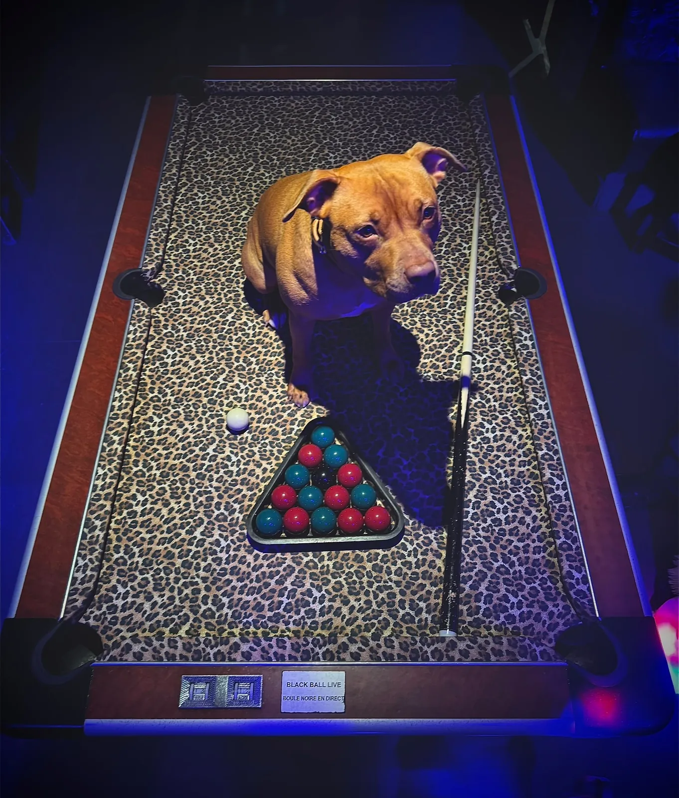

# BRIEF V2.4 — LA VIDÉO, L'ENTRÉE, ET LA CHASSE AUX BUGS

Le site est validé. Ce lot ne change **aucun parti pris** : il ajoute la vidéo du
chien, ajoute l'écran d'entrée, et rend le tout irréprochable sur téléphone comme
sur ordinateur.

Objectif formulé par le client, mot pour mot : *« comme un site Shopify — en
arrière-plan ça ne bug pas du tout, sur téléphone comme sur ordi »*. La référence
n'est pas l'esthétique, c'est **la sensation de solidité**. Aujourd'hui le scroll
« se relance » par moments, au doigt comme à la souris. C'est ça qu'on tue.

---

## §0 · RÈGLES DU LOT

1. **Ne rien changer qui n'est pas listé ici.** Pas de refactor, pas de renommage,
   pas d'« amélioration » au passage.
2. **`js/hero.js` :** une seule modification autorisée, celle du §5.4, dans son propre
   commit, avec la procédure de retour arrière écrite. Tout le reste du fichier est
   intouchable. En cas de doute : on ne touche pas.
3. **Un commit par section.** Si une section coince, les autres partent quand même.
4. Chaque modification de `css/main.css` ou `js/main.js` s'accompagne d'un bump du
   `?v=` correspondant. C'est ce qui t'a déjà coûté du temps deux fois.
5. Mesurer avant, mesurer après. Une optimisation non mesurée n'est pas une
   optimisation, c'est une conviction.

---

## §1 · LA VIDÉO DU CHIEN

### 1.1 — Les fichiers

Déjà encodés et déposés :

```
assets/video/chien-oeil.mp4     720 × 846 · 1,1 Mo · H.264 · faststart
assets/video/chien-oeil.webm    720 × 846 · 1,5 Mo · VP9
assets/photos/chien-oeil-poster.webp   première frame, 123 ko
```

Source : Kling 3.0, 5,04 s, 24 i/s, 121 frames. Les deux encodages ont un
**keyframe toutes les 12 frames** (une demi-seconde) : c'est volontaire, c'est ce qui
permet de scruber la vidéo sans à-coups. Ne pas les ré-encoder avec des réglages par
défaut, on perdrait exactement ça.

### 1.2 — Où elle va

Elle **remplace** `chien-billard-debout.webp` dans le chapitre 02, au même endroit,
au même format. C'est la même image, animée : le plan part du billard entier et
avance jusqu'à l'œil du chien.

La photo `chien-billard-debout.webp` **reste dans le dossier** : elle sert de repli
et de poster.

### 1.3 — Comment elle joue

**Pilotée par le scroll, pas en lecture automatique.** On déplace `currentTime` en
fonction de la progression de la section dans le viewport. Le visiteur avance vers
l'œil en scrollant : c'est lui qui entre dans le chien.

Contraintes non négociables :

- **IntersectionObserver + une boucle rAF bornée**, jamais de ScrollTrigger. Le hero
  est pinné au-dessus ; tout ScrollTrigger placé en dessous mesure faux. C'est la
  règle du projet depuis le début.
- La boucle rAF **ne tourne que quand la section est visible**. Elle s'arrête sur
  `document.hidden` et à la sortie du viewport. Une boucle qui tourne en fond, c'est
  de la batterie brûlée et du jank ailleurs sur la page.
- On ne touche `currentTime` que si la valeur cible diffère de plus de **1/24 s** de
  la valeur courante. Sans ce seuil, on repositionne la vidéo à chaque frame pour rien
  et le décodeur sature — c'est la première cause de saccade sur ce type d'effet.
- `preload="metadata"`, pas `auto`. Le fichier ne se charge que quand la section
  approche (marge de 600 px, comme l'embed Instagram).

```html
<figure class="chien-video" data-reveal>
  <video
    id="chienVideo"
    poster="assets/photos/chien-oeil-poster.webp"
    width="720" height="846"
    muted playsinline preload="metadata"
    disablepictureinpicture>
    <source src="assets/video/chien-oeil.webm" type="video/webm">
    <source src="assets/video/chien-oeil.mp4"  type="video/mp4">
    
  </video>
  <figcaption>Il te regarde depuis le billard.</figcaption>
</figure>
```

### 1.4 — La fin du plan

**La vidéo ne se termine pas sur du noir.** J'avais écrit le prompt pour ça, le modèle
ne l'a pas suivi : elle finit sur l'œil en très gros plan, iris ambré, pupille noire
au centre mais pas plein cadre.

C'est au code de finir le geste. Sur les **15 derniers pour cent** de la progression,
un voile noir monte de `opacity: 0` à `1` par-dessus la vidéo, en `transform`/`opacity`
uniquement. Quand le voile est plein, la section suivante commence. Le raccord est
propre et on garde l'idée : on entre dans le noir par l'œil du chien.

```css
.chien-video{position:relative;max-width:520px;margin:clamp(30px,6vh,70px) auto}
.chien-video video{width:100%;height:auto;display:block;background:var(--noir-2)}
.chien-video::after{
  content:"";position:absolute;inset:0;background:var(--noir);
  opacity:var(--fade,0);pointer-events:none;
}
```

Le JS ne fait que mettre à jour `--fade`. Aucune autre propriété animée.

### 1.5 — Les portes de sortie

- **`prefers-reduced-motion`** : on ne charge pas la vidéo du tout. On affiche
  `chien-billard-debout.webp`. Pas de vidéo en pause, pas de poster figé : la photo.
- **`navigator.connection.saveData`** : idem, la photo.
- **Échec de chargement** (`error` sur le `<video>`) : idem, la photo. Le `` de
  repli dans le `<video>` couvre déjà les navigateurs sans support.
- **Sur mobile**, le scrub reste actif mais **vérifie-le sur un vrai iPhone**. iOS
  refuse le `play()` mais autorise le déplacement de `currentTime` sur une vidéo
  `muted playsinline` — c'est le comportement dont on dépend. Si ça ne suit pas :
  repli sur une lecture automatique unique en boucle, pas sur un écran noir.

### 1.6 — Ce qu'il faut vérifier à l'écran

Scroller lentement, puis vite, puis remonter. La vidéo doit suivre dans les deux sens
sans sauter et sans se figer. Puis onglet en arrière-plan pendant la lecture, retour :
rien ne doit être bloqué.

---

## §2 · L'ÉCRAN D'ENTRÉE

Le client veut une entrée qui annonce l'expérience et qui laisse le site se charger
avant qu'on puisse scroller.

### 2.1 — Ce qu'on affiche

Plein écran, fond `--noir`, le logo tête de chien au centre, et trois lignes :

```
BIENVENUE DANS L'EXPÉRIENCE
Ceci est un site immersif.
Laissez-le charger — quelques secondes, et il est à vous.
```

Sous les lignes, un compteur en `--mono` : `00 %` → `100 %`, plus une barre fine
qui se remplit. Le compteur monte avec la **progression réelle**, jamais une
animation décorative qui atteint 100 % pendant que ça charge encore derrière.

À 100 %, une ligne remplace le texte : `PRÊT — FAITES DÉFILER`, le voile se lève en
0,9 s avec l'easing du site, et le scroll se débloque.

### 2.2 — Le piège à ne pas rater

**`js/hero.js` possède déjà son préchargeur, sa classe `is-locked` et son failsafe à
7 secondes.** Il ne faut surtout pas construire un second mécanisme de verrouillage
à côté : deux systèmes qui se disputent le déverrouillage, c'est un scroll bloqué
définitivement chez un visiteur sur vingt, et sans erreur en console.

La règle : **on réutilise le `#preloader` et la classe `is-locked` existants.** Le
nouvel écran est un habillage du préchargeur actuel, pas un remplaçant. La fonction
`unlock()` de `hero.js` reste la seule autorisée à déverrouiller, et son `setTimeout`
de 7 s reste le dernier filet.

Si l'habillage impose une modification de `hero.js`, **on s'arrête et on demande.**

### 2.3 — Ce que compte la progression

Trois choses, pondérées :

- les **60 premières frames** du hero (pas les 227 — on n'a pas besoin de tout pour
  démarrer, et attendre 17 Mo avant le premier scroll est inacceptable), 60 % du total ;
- `document.fonts.ready`, 20 % ;
- les images du premier écran après le hero, 20 %.

Le reste des frames continue de se charger **après** le déverrouillage, en arrière-plan.

### 2.4 — Les garde-fous

- **Plafond dur à 4 secondes.** Au-delà, on lève le voile même si tout n'est pas
  chargé. Un préchargeur qui dépasse 4 s fait fuir plus de monde qu'il n'en
  impressionne — et c'est un motif d'élimination en jury.
- **Une seule fois par session** : `sessionStorage` est interdit par les règles du
  projet, donc on utilise une variable en mémoire. Le visiteur qui revient depuis
  `contact.html` ne revoit pas l'écran.
- Sous `prefers-reduced-motion` : le texte s'affiche, le voile disparaît en fondu de
  200 ms, pas d'animation de barre.
- L'écran est **annoncé aux lecteurs d'écran** : `role="status"` et `aria-live="polite"`
  sur le compteur, et un vrai focus rendu au document au déverrouillage.
- Bouton `PASSER` en bas à droite, visible au clavier, qui déverrouille immédiatement.
  Personne ne doit être prisonnier d'une animation.

---

## §3 · LE SCROLL QUI « SE RELANCE » — la vraie cause

C'est la remarque la plus importante du client et elle a une cause identifiable.

**Lenis en mode tactile.** Sur téléphone, un lissage JavaScript se superpose à
l'inertie native du système. Les deux courbes de décélération ne coïncident jamais :
le doigt s'arrête, le système freine, Lenis continue un peu, puis rattrape. C'est
exactement la sensation de « relance » décrite. Sur iOS c'est pire, parce que le
navigateur gère l'inertie hors du fil principal et que le JS ne peut pas s'y aligner.

**Correction :**

```js
new Lenis({
  lerp: 0.11,
  smoothWheel: true,     // molette et trackpad : oui
  syncTouch: false,      // tactile : on laisse le système faire son travail
  touchMultiplier: 1,
})
```

Le natif est meilleur que tout ce qu'on écrira sur mobile. On ne perd rien : le
scroll lissé garde tout son intérêt là où il sert, c'est-à-dire à la molette.

Puis, dans l'ordre :

- **`gsap.ticker.lagSmoothing(0)`** doit être présent (il l'est déjà) — sans ça GSAP
  compense les frames perdues par un saut visible.
- **Un seul `requestAnimationFrame` dans toute la page**, piloté par `gsap.ticker`,
  Lenis branché dessus. Vérifier qu'aucun effet ajouté depuis la V2.1 n'a ouvert sa
  propre boucle. Compter les `requestAnimationFrame(` dans `js/main.js` : il doit y
  en avoir **un seul**.
- **`will-change` seulement pendant l'animation.** Un `will-change` permanent sur
  plusieurs éléments crée autant de couches de composition, et c'est une cause
  classique de saccade sur les téléphones milieu de gamme. Le poser à l'entrée dans
  le viewport, le retirer à la fin de la transition.
- **Aucune animation de `top`, `left`, `width`, `height`** — vérifier, pas supposer.
- **`content-visibility: auto` + `contain-intrinsic-size`** sur les sections situées
  sous le premier écran. C'est le gain le moins cher du lot : le navigateur ne calcule
  plus la mise en page de ce qui n'est pas visible. **Ne jamais l'appliquer à une
  section pinnée ni à une cible d'ancre**, sinon les mesures partent en vrille.
- **Écouteurs `touchstart`/`touchmove` en `{passive: true}`.** Un seul écouteur non
  passif suffit à retarder chaque geste.
- **`100dvh` au lieu de `100vh`** partout où la hauteur d'écran est utilisée. Sur
  mobile, la barre d'URL qui se rétracte redimensionne le viewport et provoque un
  saut. Et `ScrollTrigger.config({ ignoreMobileResize: true })`.

---

## §4 · PASSE DE DÉBOGAGE COMPLÈTE

À faire méthodiquement, en notant ce qui est trouvé.

**Console.** Zéro erreur, zéro avertissement, sur les quatre pages, au chargement et
après un parcours complet. Y compris les avertissements de ressource non trouvée et
les violations de politique de sécurité (la CSP du `netlify.toml` est stricte).

**Réseau.** Aucun 404. Toutes les images ont `width`/`height` réels, `loading="lazy"`
et `decoding="async"` sauf celles du premier écran.

**Redimensionnement.** Passer lentement de 320 px à 1920 px de large. Aucun
débordement horizontal, aucun texte coupé, aucune image écrasée. Puis en hauteur :
480 px à 1200 px.

**Onglet en arrière-plan.** Quitter l'onglet pendant le préchargement du hero, pendant
la vidéo du chien, pendant le carrousel. Revenir. Rien n'est figé, rien ne s'emballe,
rien n'a sauté.

**Mobile réel, pas seulement l'émulateur.** iPhone Safari et Android Chrome.
Points d'attention : le hero qui se déverrouille bien en 4G ; la barre d'URL qui
s'anime pendant le scroll ; le menu plein écran qui se ferme ; les zones tactiles à
44 px minimum ; pas de zoom involontaire au double-tap ; les `100dvh`.

**Clavier.** Parcourir tout le site à la tabulation. Chaque élément focusable a un
contour visible. Échap ferme tout ce qui s'ouvre. Aucun piège de focus, sauf dans le
menu ouvert où c'est voulu.

**JS désactivé.** Le site reste lisible, les coordonnées et les horaires sont dans le
HTML, le formulaire fonctionne.

**Lighthouse mobile**, en 4G simulée, sur `index.html` et `contact.html` :
LCP < 2,5 s, INP < 200 ms, CLS < 0,1. Noter les chiffres avant et après le lot.

---

## §5 · OPTIMISATION

### 5.1 — Ce qui rapporte le plus, dans l'ordre

1. `content-visibility: auto` sur les sections hors écran (§3).
2. Le `?v=` sur CSS et JS — pas une optimisation, mais sans ça rien n'est visible.
3. `fetchpriority="high"` sur la première frame du hero, `fetchpriority="low"` sur
   tout ce qui est sous le premier écran.
4. Retirer les `will-change` permanents.
5. `font-display: swap` partout, et vérifier qu'aucune fonte non utilisée n'est
   préchargée. Il y a 12 `.woff2` : compter combien sont réellement appelés.

### 5.2 — Ce qu'il ne faut PAS faire

Ne pas minifier à la main, ne pas concaténer les fichiers, ne pas passer les images en
AVIF dans ce lot, ne pas remplacer GSAP par des animations CSS. Chacune de ces idées
est défendable et aucune n'a sa place ici : le site marche, on le fiabilise.

### 5.3 — Le poids des frames

Le hero charge 227 frames, soit 17,6 Mo sur desktop. C'est le seul vrai coût du site.
**Ne rien y changer dans ce lot.** Simplement mesurer et rapporter : temps de
préchargement réel des 60 premières frames en 4G simulée, et temps jusqu'au premier
scroll possible. Ce chiffre décidera d'un éventuel lot suivant.

### 5.4 — La seule modification autorisée dans `hero.js`

Commit isolé, intitulé `hero: décodage hors du fil principal`.

Aujourd'hui les frames sont dessinées dès `img.onload`. Le décodage JPEG/WebP se fait
alors sur le fil principal, au moment du dessin, et c'est une cause possible de
micro-saccades pendant le scrub. Ajouter un `await img.decode()` avant de considérer
l'image comme prête laisse le navigateur décoder hors du fil principal.

**Conditions :**

- L'appel est enveloppé dans un `try/catch` qui retombe sur le comportement actuel.
  `decode()` rejette sur certaines images en cache dans de vieux Safari.
- `img.onerror` continue de marquer la frame comme réglée. Une frame manquante ne doit
  **jamais** bloquer la page — c'est la règle la plus importante du fichier.
- Le `setTimeout(unlock, 7000)` n'est pas touché.
- Le `unlock()` des sorties anticipées n'est pas touché.
- Mesure avant/après. **Si le gain n'est pas mesurable, on annule le commit.**

Si quoi que ce soit d'autre semble devoir bouger dans `hero.js` : on s'arrête et on
demande. Le hero est ce que la cliente préfère dans le site.

---

## §6 · RÈGLES À APPLIQUER, ISSUES DES SKILLS

Le skill `awwwards-lab` du dépôt contient déjà le socle. Trois règles s'y ajoutent
pour ce lot, et sont ajoutées au skill dans `references/debug-scroll.md` :

1. **Le scroll lissé se désactive au tactile.** Le natif gagne toujours sur mobile.
2. **Toute vidéo pilotée par le scroll a un seuil de repositionnement** d'au moins une
   frame. Sans seuil, le décodeur sature et la vidéo se fige.
3. **Un préchargeur affiche une progression réelle et a un plafond dur.** Une barre
   décorative qui atteint 100 % avant la fin est un mensonge que le visiteur ressent.

---

## §7 · CHECKLIST DE LIVRAISON

- [ ] La vidéo du chien se scrube dans les deux sens, sur ordinateur et sur iPhone réel.
- [ ] Le voile noir ferme le plan proprement, sans coupure visible.
- [ ] Reduced-motion, saveData et échec de chargement affichent tous les trois la photo.
- [ ] L'écran d'entrée affiche une progression réelle, se lève en moins de 4 s quoi
      qu'il arrive, et possède un bouton PASSER accessible au clavier.
- [ ] Un seul mécanisme de verrouillage dans toute la page. `unlock()` de `hero.js`
      reste le seul point de sortie.
- [ ] Le scroll ne « se relance » plus au doigt. Testé sur iPhone et sur Android.
- [ ] Un seul `requestAnimationFrame` dans `js/main.js`.
- [ ] Aucun `will-change` permanent.
- [ ] `100dvh` partout, plus aucun `100vh`.
- [ ] Console propre sur les quatre pages, aucune violation CSP.
- [ ] Aucun débordement horizontal de 320 px à 1920 px.
- [ ] Lighthouse mobile relevé avant et après, chiffres notés dans le rapport.
- [ ] `git diff js/hero.js` est vide, **sauf** le commit isolé du §5.4 s'il a été
      conservé.
- [ ] `netlify.toml` est committé, dans son propre commit — sans lui, aucune des
      règles de cache, de CSP et de détection du formulaire n'arrive sur Netlify.
